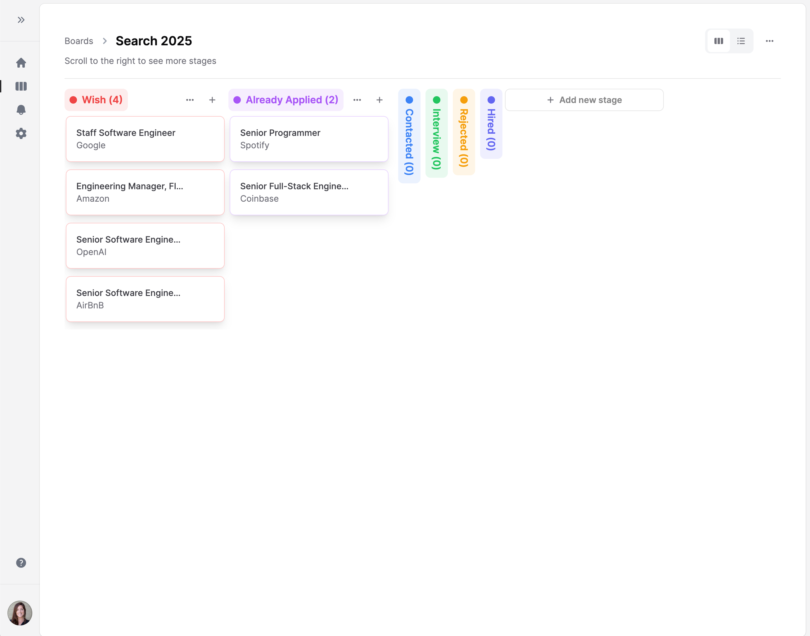

[](https://github.com/j4rs/ApplyWise/actions/workflows/ci.yml)

### ApplyWise

ApplyWise (I didn't find a better name) is a comprehensive job application assistant that helps you streamline your job search process. It provides a suite of tools to make your job hunting more efficient and effective. Check [HOW_IT_WORKS.md](HOW_IT_WORKS.md) for a more detailed explanation.





### Key Features

- **CV PDF Parser**: Extract skills and experience from your resume automatically
- **Application Tracking System (ATS)**: Keep track of all your job applications in one place
- [In development] **Custom Resume Builder**: Generate tailored resumes for each job application
- [In development] **Custom Questions**: Generate tailored answers for for each job application custom questions
- [In development] **Cover Letter Generator**: Create personalized cover letters for each position

### Coming (not that soon)
- **Interview Preparation**: Get customized interview questions based on job descriptions
- **Interview Practice Tool**: Prepare effectively for your upcoming interviews


## Build and Run Locally

### Prerequisites

- Ruby 3.2.2 (check `.ruby-version` for exact version)
- PostgreSQL
- Node.js 18+ and Yarn
- Docker (optional, for development)
- OpenAI API key and organization ID (Unless you just want to use the ATS to organize your search)

### Installation Steps

1. Clone the repository:

   ```bash
   git clone https://github.com/j4rs/ApplyWise.git
   cd ApplyWise
   ```
2. Install Ruby dependencies:

   ```bash
   ./bin/setup
   ```
3. Install JavaScript dependencies:

   ```bash
   yarn install
   ```
4. Set up OpenAI credentials:

   ```bash
   # Create your credentials file
   EDITOR="code --wait" bin/rails credentials:edit
   ```

   Add the following structure to the credentials file:

   ```yaml
     mission_control:
       http_basic_auth_user: admin
       http_basic_auth_password: your_mission_control_password

     aws:
       access_key_id: your_aws_id
       secret_access_key: your_aws_secret

     open_ai:
       dev:
         access_token: your_openai_api_key
         organization: your_openai_organization_id
   ```

5. Set up environment variables:

   ```bash
   touch .env
   ```

   Example of my local env vars:

   ```
    SOLID_QUEUE_IN_PUMA=true
    LAUNCHY_DRY_RUN=true # used by letter_opener
    BROWSER=/dev/null # used by letter_opener

    ESBUILD_UPDATE_SERVER_PORT=3036
    REACT_APP_RAILS_ENV=development

    RAILS_PORT=3100
   ```

7. Start the development server:
   ```bash
   ./bin/dev
   ```

The application will be available at `http://localhost:3100` and the active jobs dashboard at http://localhost:3100/active_jobs (use the credentials for mission control set in step [4]).

The application does not send real emails (yet). So capture them with `letter_opener` at http://localhost:3100/letter_opener

### Development with Docker

Alternatively, you can use Docker for development (not tested):

```bash
docker compose up
```

## Technology Stack

- **Backend**: Ruby on Rails 8.x
- **Frontend**: React + JS + TypeScript
- **Database**: PostgreSQL
- **Styling**: Tailwind CSS
- **Deployment**: Kamal (Docker-based)
- **AI Integration**: OpenAI API

## Contributing

Contributions to ApplyWise are welcome:

1. Fork the repository
2. Create a new branch for your feature:
   ```bash
   git checkout -b your-feature-name
   ```
3. Make your changes and commit them:
   ```bash
   git commit -m "Description of your changes"
   ```
4. Push to your fork:
   ```bash
   git push origin feature/your-feature-name
   ```
5. Create a Pull Request

### Development Guidelines

- Follow Ruby style guide and use Rubocop for linting
- Follow TypeScript/React best practices
- Write clear commit messages
- Include tests for new features
- Update documentation as needed

### Reporting Issues

If you find a bug or have a feature request, please open an issue on GitHub with:

- A clear description of the problem
- Steps to reproduce
- Expected vs actual behavior
- Screenshots if applicable

## License

This project is licensed under the MIT License - see the LICENSE file for details.
